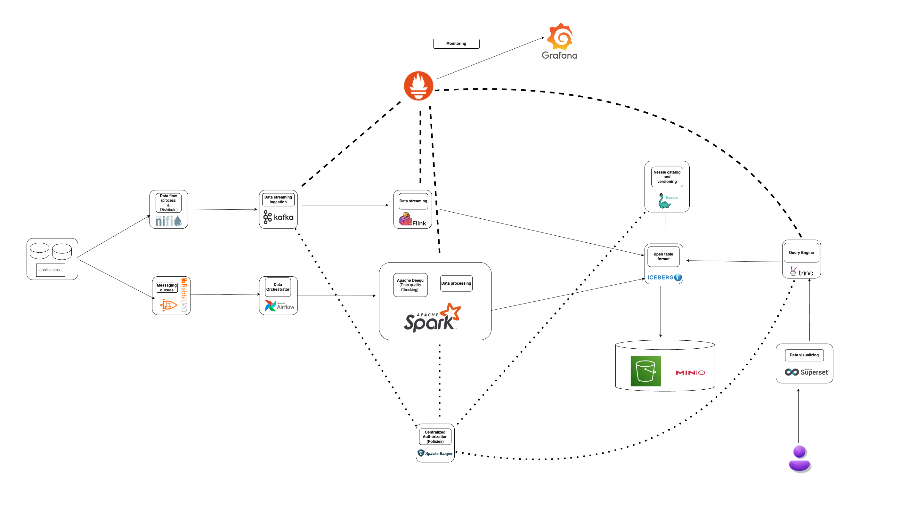

# 🚀 Open-Source Big Data Platform

An end-to-end Data Engineering Platform built using modern open-source tools.  
Supports ingestion, streaming, batch processing, lakehouse storage, querying, and visualization.



## 📌 Features

- Real-time + Batch Processing (Kafka, Flink, Spark)
- Lakehouse Architecture (Iceberg + Nessie + MinIO)
- Workflow Orchestration (Airflow)
- Data Ingestion (NiFi)
- Distributed SQL Querying (Trino)
- BI Dashboards (Superset)
- Monitoring (Prometheus + Grafana)
- Optional Authorization (Ranger)


---

## 🧩 Tech Stack

### Infrastructure
- PostgreSQL
- MongoDB
- MinIO
- Redis

### Messaging
- Kafka + Zookeeper
- Schema Registry
- Kafka UI
- RabbitMQ

### Data Flow
- Apache NiFi

### Orchestration
- Apache Airflow (CeleryExecutor)

### Processing
- Apache Spark

### Streaming
- Apache Flink

### Catalog
- Project Nessie
- Hive Metastore

### Table Format
- Apache Iceberg

### Query Engine
- Trino

### Visualization
- Apache Superset

### Monitoring
- Prometheus
- Grafana

### Optional
- Apache Ranger

---

## ⚡ Quick Start

```bash
git clone https://github.com/bhuvaneswaran21/data-platform.git
cd data-platform
docker compose up -d

## With Ranger

docker compose --profile ranger up -d  
```
---